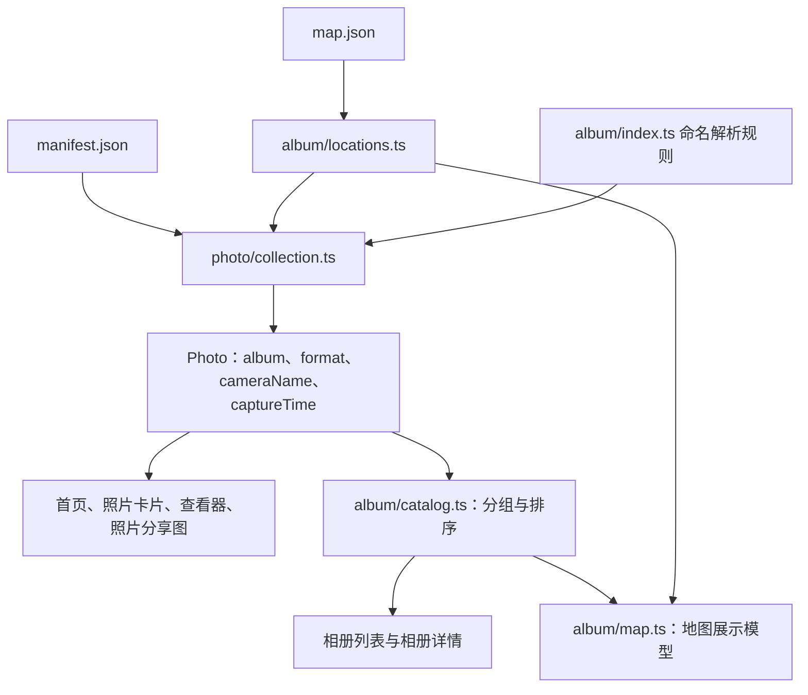

# 照片与相册数据流整理

## 目标与范围

把照片所属相册、资源格式和相机名称的解释集中到服务端照片集合组装阶段。首页标题、照片卡片、详情面板与分享图直接读取已建立的照片模型，不再从路径或相册文件夹名称推导这些信息。

保留现有照片集合、相册目录与地图展示入口，不引入总服务、额外查询层或兼容转发模块。详细参数的文字格式化、信息行顺序、布局与筛选仍由对应展示模块负责。本次不修改 pipeline、manifest、map.json、路由规则或时间转换行为，也不增加依赖或测试文件。

## 数据流

| 模块                                               | 职责                                                                         |
| -------------------------------------------------- | ---------------------------------------------------------------------------- |
| `album/index.ts`                                   | 相册类型、键归一化、文件夹命名解析、相册日期格式化；不加载数据               |
| `album/locations.ts`                               | 读取、校验地点配置，输出按归一化相册键索引的坐标与时区                       |
| `photo/collection.ts`                              | 并行加载两份配置、校验照片、排序、归一化资源 URL、建立相册关系与公共派生字段 |
| `photo/capture-time.ts`                            | 将带偏移的拍摄时刻转换为拍摄地的日期、时间与 UTC 偏移文本                    |
| `album/catalog.ts`                                 | 将已组装照片按 `photo.album.key` 分组，排序相册并提供查找                    |
| `album/map.ts`                                     | 根据相册目录与地点配置选择地图封面、组装地图条目                             |
| `photo/formatters.ts`、`photo/capture-settings.ts` | 字节、光圈、焦距等轻量格式化，以及拍摄参数展示规则                           |
| `viewer-metadata.ts`                               | 按详情面板需要的顺序组织信息行与缺省文字                                     |
| 路由 `_data.ts`                                    | 查找具体资源并处理 404                                                       |

`album/index.ts` 与 `photo/index.ts` 之间只有类型引用，不引入运行时循环；基础模块不重新导出服务端加载函数。

## 模型与相册关系

照片使用 `album: AlbumDescriptor` 替代 `albumKey`，不同时保留两份键。描述对象仅包含只读的 `key`、`title` 与 `date`，不包含照片数组、地图坐标或展示布局。

`getPhotoCollection` 使用调用内的 Map，每个相册键只解析一次，同一本相册的照片共享同一个描述对象。删除此前模块级的相册描述缓存；解析函数 `parseAlbumDescriptor` 保持纯函数。相册描述的生命周期与这次集合组装一致，缓存状态不跨集合或请求保存。

相册目录复用 `photo.album` 的信息，只增加照片列表，不再解析文件夹。照片持有基础描述，相册持有照片，二者不会互相引用形成循环对象。共享描述对象也让 RSC 可以按引用复用序列化结果，避免为每张照片创建相同的对象副本。

文件夹日期仍是相册日期；首页随当前照片显示的是拍摄地日期。两者可能不同，不互相替代。

## 公共派生信息

照片集合统一生成：

- `format`：资源扩展名优先、MIME 回退，统一大写。明确匹配末尾的扩展名，避免原有 split 在无扩展名时把整个路径当作格式。表示网站提供的原图资源格式，不推断相机源文件格式。
- `cameraName`：由 EXIF 的厂商与型号拼接；都缺失时为 `null`。详情可显示 Unknown，分享图可省略，缺省展示由调用方决定。
- `captureTime`：沿用现有拍摄地时区处理，字段仍为 `date`、`dateTime` 与 `timeZone`。

删除 `formatMimeLabel` 与 `formatCameraLabel`，调用方读取派生字段。首页分享图的相机选择仍取照片集合中第一个非空名称，不改变现有选择规则。

保留原始 `camera`、`image`、字节数与尺寸：详情、卡片和分享图有不同的表达方式，不能用一种展示文字替代原始数值。尤其是实际焦距与 35mm 等效焦距仍是不同字段，不在集合中合并。

manifest 的 Zod 校验保证 `camera` 与 `image` 对象存在，因此移除它们本身的可选链；内部可选字段仍保留缺省处理。

## 为什么不预生成全部详情行

详情面板当前消费当前照片，瀑布流只挂载可见区域附近的卡片。若在集合中为每张照片提前生成全部详情行，首页也会传输大量尚未使用的文字，并让公共模型绑定详情行标题、顺序和分组。

因此统一数据解释与关联，保留就近的纯展示转换。`getPhotoInfoRows` 只读取照片模型并组织行，不读取文件、解析相册键或判断资源格式。动态进度、缩放比例和直方图也继续在对应交互模块计算。

`collection.ts` 负责组装，不承担地图封面选择、详情布局或相册目录查找。只有一个调用方的小型转换保持就地实现，不为它们新增抽象层。

首页标题的字段映射直接放在 `use-gallery-header.ts` 的照片切换回调中，`GalleryHeaderState` 类型也由该 hook 导出。删除只包含简单映射的 `gallery-header-state.ts`，标题状态与发布逻辑就近组织。

## 缓存与行为约定

- manifest 与地点表继续并行加载，fetch 保持 30 秒重验证。
- `React.cache` 复用一次请求内的集合、地点解析和目录结果，不表示跨请求永久缓存模型。
- HTTP 404 的 map.json 继续按空地点表处理，其余加载或校验错误仍正常抛出。
- 照片仍按原始 `takenAt` 时间戳倒序；相册仍按文件夹日期倒序。分组保持照片原有顺序，因此封面选择不变。
- `id`、slug、资源 URL、文件名、宽高比、相册路径与照片路径规则保持原样。
- 原始 manifest 与前端照片模型之间的结构变化集中在集合组装处。展示调用方不再依赖相册命名解析或媒体路径规则。

## 验证

在修改前保存本地 459 张照片的详情行、设备行、曝光行、首页标题、拍摄参数、资源格式和相机名称快照。修改后比较相同输出，验证此次重构没有改变既有展示。

复核同相册照片共享描述、照片与相册无循环引用、集合与相册顺序、地图条目及封面数量，以及首页标题的主导相册选择。

实施验证结果：

- 使用 Node 24 完成格式检查、lint、TypeScript 检查、已有的 2 个测试和生产构建，30 个静态页面生成成功。
- 从生产首页 RSC 数据读取实际组装的 459 张照片，详情、设备、曝光、首页标题、拍摄参数、资源格式和相机名称全部与修改前快照一致。
- 同相册照片在 RSC 数据中复用描述引用，共 22 个描述对象；不存在旧 `albumKey` 字段或照片与相册的循环引用。
- 照片排序与 manifest 拍摄时间倒序一致，原始相机、图像信息和拍摄时刻不变；原图与缩略图 URL 符合原有转换规则。
- 从生产地图 RSC 数据核对全部 22 个相册的顺序、坐标、照片数量与前 3 张封面，结果正确。
- 校验瀑布流主导相册选择与切换阈值行为不变。

此次验证使用一次性脚本和已有测试，不新增测试文件。`git diff --check` 通过；复核源码不再引用旧的相册描述获取函数、格式及相机名称格式化函数，或照片的旧 `albumKey` 字段。
